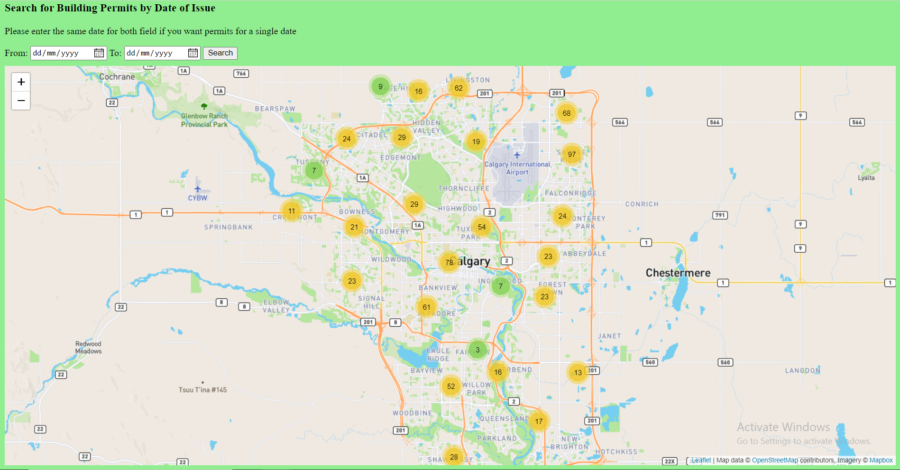

# Advance Geospatial Topics Lab Assignment 4

## Objectives
* Gain experience with Turf.js for spatial analysis on web mapping applications
* Make a map of Calgary Schools and Calgary Hospitals and Health Clinics

## Table of contents
* [General info](#general-info)
* [Technologies](#technologies)
* [Demo](#demo)
* [Illustrations](#illustrations)

## General info
 This project is about building a web mapping application for schools, health clinics and hospitals in the city of Calgary, Canada. Users will be able to visualize and schools, hospitals and health clinics in the city of Clagary, and also find out which Hospital or Health clinic is closest to a selected school.
 The schools, hospitals and health clinics datasets are both from the City of Calgary’s Open Data Portal. 

## Technologies
This project is created with:
* Python 3.7
* Flask
* Bootstrap 4
* Mapboxgl.js
* Turf.js (a JavaScript library for spatial analysis)

## Demo
The working demo video can be found [here](https://youtu.be/)

## Illustrations
The homepage of the web mapping app is as shown below.

## Contact
Created by ***** - feel free to contact me
