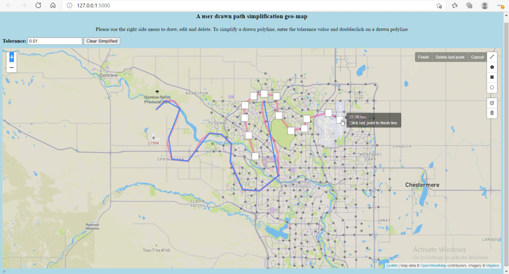

# Advance Geospatial Topics Lab Assignment 5

## Objectives
* Gain experience with Turf.js for spatial analysis specifically line simplification on web mapping applications
* Client-side polyline drawing and editting

## Table of contents
* [General info](#general-info)
* [Technologies](#technologies)
* [Demo](#demo)
* [Illustrations](#illustrations)

## General info
This project is about using Turf.js to add line simplification to your web mapping applications. You will be allowing a user to draw a polyline. 
The user should be able to interact with the web map to show a simplified version of the polyline drawn by the user in a different color.

## Technologies
This project is created with:
* Python 3.7
* Flask
* Bootstrap 4
* Leaflet.js
* Leaflet-draw.js
* Turf.js (a JavaScript library for spatial analysis)

## Demo
The working demo video can be found [here](https://youtu.be/J4h2Di2iaX0) and the live demo can be accessed [here](https://timeless-h.github.io/Lab5/templates/map_page.html)

## Illustrations
A screenshot of the web mapping app showing a drawn polylines (Pink) and their simplified version (Blue).

## Contact
Created by ***** - feel free to contact me

