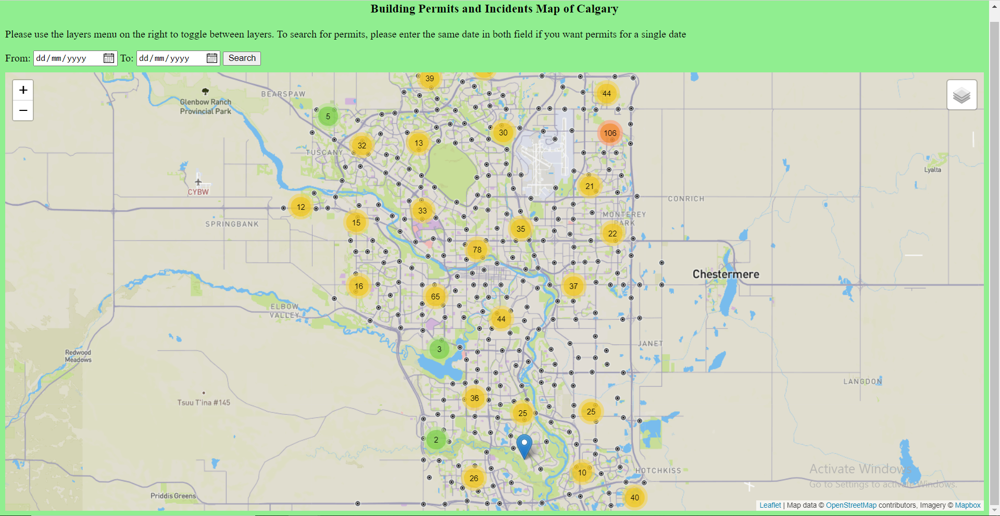

# Advance Geospatial Topics Final Semester Project

## Table of contents
* [Objective](#objective)
* [General info](#general-info)
* [Technologies](#technologies)
* [App documentation](#app-documentation)
* [Demo](#demo)
* [Illustrations](#illustrations)

## Objective
* Design a geo-web mapping application for taxi drop-off/pick-up hotspots in the city of Porto, Portugal for a user-chosen day and time range. 

## General info
In order to build smart cities, it is esential to understand the spatio-temporal social dynamics of that city.
Considering taxis are everywhere and go almost anywhere in aa city at any time, their trajectory data is a good way to
understand spatio-temporal social dynamics, more specifically in the case of this project, the major movements of residents
of a city - which in turn reflect the goto places in a city. Thus, this project is a about building a geo-web mapping application 
for taxi drop-off/pick-up hotspots in the city of Porto, Portugal for a user-chosen day and time range. In essence, users can 
select a day of the week and a time interval, and they will be provided with the possible pick-up/drop-off locations to either get a taxi (a as passenger) or a customer (as a taxi driver).

## Technologies
This project is created with:
* Python 3.7
* Flask
* Bootstrap 4
* Mapbox Studio
* Mapboxgl.js 
* ArcGIS Pro

## App documentation
This section contains the guide on how to use the designed geo-web map application and an outline of its functionalities

#### Functionalities
* Users can obtain for any day of the week, the possible locations in the city to get a taxi (if a passenger) or a customer (if a taxi driver). 
* For more accurate results, users can further choose from six 4-hour time intervals for possible hotspots within that time frame.
* A legend is provided for efficient comprehension of the various color codes used in the map.

#### User guide
*

## Demo
The working demo video can be found [here](https://youtu.be/J4h2Di2iaX0) and the live demo can be accessed [here](https://timeless-h.github.io/Lab5/templates/map_page.html)

## Illustrations
Some images of the homepage and the incident map layer of the web mapping app where we can toggle on/off permits and incidents. When a search is run, the permits are filtered and the selected results are returned.

Incidents map layer overlayed with permits

## Contact
Created by Hailun Yan & Perpetual H. Akwensi - feel free to contact us: ***@ucalgary.ca; perpetual.akwensi@ucalgary.ca
