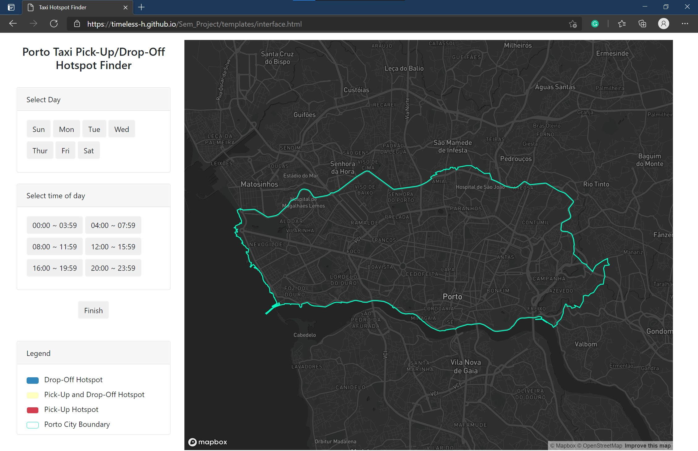
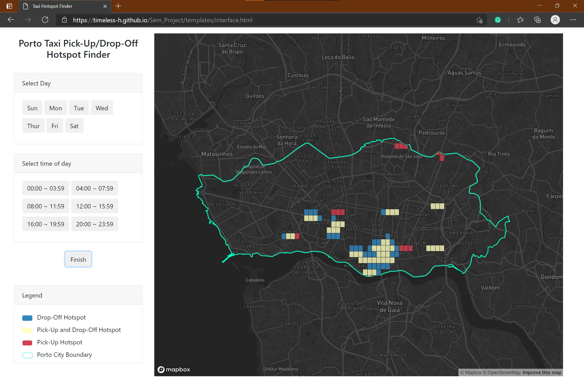

# Advance Geospatial Topics Final Term Project

## Table of contents
* [Objective](#objective)
* [General info](#general-info)
* [Technologies](#technologies)
* [App documentation](#app-documentation)
* [Demo](#demo)
* [Illustrations](#illustrations)

## Objective
* Design a geo-web mapping application for taxi drop-off/pick-up hotspots in the city of Porto, Portugal for a user-chosen day and time range. 

## General info
In order to build smart cities, it is esential to understand the spatio-temporal social dynamics of that city.
Considering taxis are everywhere and go almost anywhere in aa city at any time, their trajectory data is a good way to
understand spatio-temporal social dynamics, more specifically in the case of this project, the major movements of residents
of a city - which in turn reflect the goto places in a city. Thus, this project is a about building a geo-web mapping application 
for taxi drop-off/pick-up hotspots in the city of Porto, Portugal for a user-chosen day and time range. In essence, users can 
select a day of the week and a time interval, and they will be provided with the possible pick-up/drop-off locations to either get a taxi (a as passenger) or a customer (as a taxi driver).

## Technologies
This project is created with:
* Python 3.7
* Flask
* Bootstrap 4
* Mapbox Studio
* Mapboxgl.js 
* ArcGIS Pro

## App documentation
This section contains the guide on how to use the designed geo-web map application and an outline of its functionalities

#### Functionalities
* Users can obtain for any day of the week, the possible locations in the city to get a taxi (if a passenger) or a customer (if a taxi driver). 
* For more accurate results, users can further choose from six 4-hour time intervals for possible hotspots within that time frame.
* A legend is provided for efficient comprehension of the various color codes used in the map.

#### User guide
* Download and install (`python 3.7`)
* Download and install and IDE (e.g., Pycharm, VSCode, Sublime, Atom, etc.)
* Using Pycharm as an example:
    * In ur terminal install `Flask` via `pip3 install`
* Download our repository to your working directory, and in the terminal navigate to this working directory. 
* Set the environment variable `FLASK_APP` to be `app.py`. On a Mac or on Linux, the command to do this is `export FLASK_APP=app.py`. 
On Windows, the command is instead `set FLASK_APP=app.py`. This is optionally but you can also set the environment variable `FLASK_DEBUG` to `1` to activate Flask’s debugger
which will automatically reload your web application whenever you save changes.
* Run flask run to start up the application.

---
* In the `app.py`: 
    * and the `.\interface` route handles the rendering of the web app interface and map in `\templates\interface.html`. 
---

#### Development
If you are interested in contributing to our project (i.e., to fix a bug or enhance an existing module), follow these steps:

- Fork the repo
- Create a new branch (`git checkout -b improve-feature`)
- Make the appropriate changes in the files
- Add changes to reflect the changes made
- Commit your changes (`git commit -am 'improve feature'`)
- Push to the branch (`git push origin improve-feature`)
- Create a Pull Request 

#### Bug(s)
If you find a bug and you wish to make us aware, kindly open an issue [here](https://github.com/Timeless-H/Adv-Geo-Topics/issues/new).

## Demo
The working demo video can be found [here](https://youtu.be/hP6hAh1Wr1o) and the live demo can be accessed [here](https://timeless-h.github.io/Adv-Geo-Topics/term_project/templates/interface.html)

## Illustrations
Some screenshots of the developed geo-web. 

The app's default page showing the boundary of the city of Porto, here, no day or time has been selected yet. 

---
An example of a hotspot given a selected day and time range

## Contact
Created by Hailun Yan & Perpetual H. Akwensi - feel free to contact us: hailun.yan@ucalgary.ca; perpetual.akwensi@ucalgary.ca
